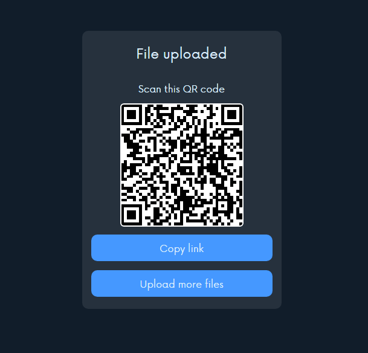

# Filesharing PWA 
Filesharing PWA is a Progressive Web Application (PWA) that allows users to share files up to 15 MB in size. The files will stay available for 30 minutes after which they will be automatically deleted from the server.

 

## Features

- Share files up to 15 MB
- Files are available for 30 minutes
- Share links or scan QR codes to download files
- Progressive Web Application (PWA)

## Getting Started

To develop Filesharing PWA locally, follow these steps:

1. Clone the repository
2. Install dependencies using `npm install`
3. Start the development server using `npm start`
4. Open the app in your browser at `http://localhost:3000`

## Usage

To use Filesharing PWA, follow these steps:

1. Open the app in your browser at https://fileshareportal.onrender.com/
2. Click the "Choose File" button to select a file to upload
3. Click the "Upload" button to upload the file
4. Share the download link or scan the QR code with the person you want to share the file with

## License

Filesharing PWA is licensed under the MIT License. See the `LICENSE` file for more information.

## Contributing

To contribute to Filesharing PWA, follow these steps:

1. Fork the repository
2. Create a new branch using `git checkout -b my-feature-branch`
3. Make changes and commit them using `git commit -m "Add some feature"`
4. Push changes to your fork using `git push origin my-feature-branch`
5. Create a pull request

## Credits

Filesharing PWA was created by [Fuad Hasan](https://github.com/itsfuad).

